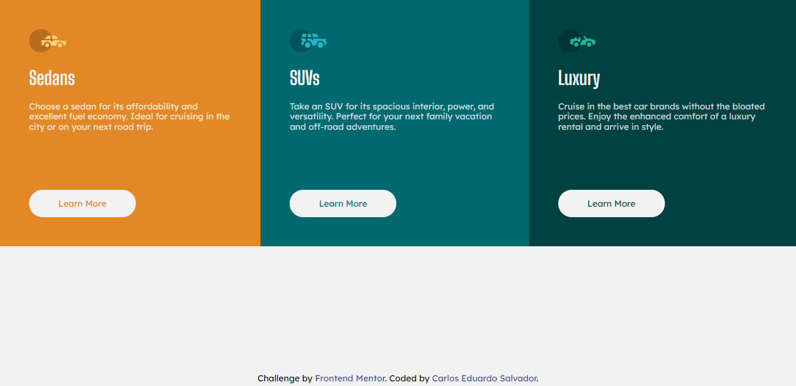

# Frontend Mentor - 3-column preview card component solution

This is a solution to the [3-column preview card component challenge on Frontend Mentor](https://www.frontendmentor.io/challenges/3column-preview-card-component-pH92eAR2-). Frontend Mentor challenges help you improve your coding skills by building realistic projects. 

## Table of contents

- [Overview](#overview)
  - [The challenge](#the-challenge)
  - [Screenshot](#screenshot)
  - [Links](#links)
- [My process](#my-process)
  - [Built with](#built-with)
  - [What I learned](#what-i-learned)
  - [Continued development](#continued-development)
  - [Useful resources](#useful-resources)
- [Author](#author)

## Overview

### The challenge

Users should be able to:

- View the optimal layout depending on their device's screen size
- See hover states for interactive elements

### Screenshot

### Links

- Solution URL: [Solution](https://www.frontendmentor.io/solutions/responsive-page-using-flexbox-Ln_wZfAAp)
- Live Site URL: [Live Site](https://3-column-preview-card-component-challenge-hub-one.vercel.app/)

## My process

### Built with

- Semantic HTML5 markup
- CSS custom properties
- Flexbox
- Mobile-first workflow
- Sass CSS pre processor
- BEM methodology

### What I learned

I used this challenge to reinforce my learning in front-end with Flexbox, in addition to revisiting Sass and Media Query concepts and reinforcing the BEM methodology concepts.

### Useful resources

- [Sass](https://sass-lang.com/guide) - This helped me for many reasons. I really learn more reading the documentation of this pre processor.
- [Flexbox](https://developer.mozilla.org/pt-BR/docs/Web/CSS/CSS_Flexible_Box_Layout) - This is an amazing documentation which helped me finally understand flexbox layout. I'd recommend it to anyone still learning this concept.

## Author

- LinkedIn - [Carlos Eduardo Salvador](https://www.linkedin.com/in/carloseduardosalvador/)
- Frontend Mentor - [@cadusalvador](https://www.frontendmentor.io/profile/cadusalvador)
- Instagram - [@echo_cadu](https://www.instagram.com/echo_cadu)
